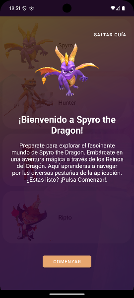
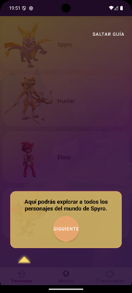
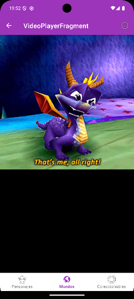
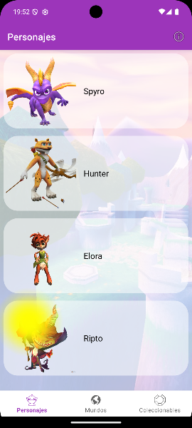

# Tarea Unidad 4 PMDM DAM : Spyro The Dragon - Guía Interactiva y Easter Eggs

## Introducción
El propósito de esta aplicación es completar la Tarea de la Unidad 3 de la asignatura PMDM de DAM. Hemos importado un proyecto ya existente y hemos agregado la funcionalidad de **guía de inicio interactiva** que ayuda a los nuevos usuarios a familiarizarse con las secciones de la app (Mundos, Coleccionables y Personajes), además de incluir secretos o **Easter Eggs**.

## Características principales
- **Guía de Inicio de 6 Pantallas**: Una secuencia de fragmentos  que explican cada parte de la aplicacion.
- **Persistencia**: Uso de `SharedPreferences` para que la guía solo se muestre la primera vez.
- **Easter Eggs**:
    - **El video Secreto**: Se activa al hacer clic 3 veces.
    - **Animación Mágica**: Se activa al dejar pulsado un rato.
- **Efectos de Sonido**: Dos tipos de sonido diferentes durante la guia.

## Tecnologías utilizadas
- Lenguaje: **Kotlin**
- Interfaz: **View Binding**, **Material Design**, **XML**
- Animaciones: **ObjectAnimator** , **Canvas**
- Video: **MediaPlayer**
- Almacenamiento: **SharedPreferences**

## Instrucciones de uso
1. **Abrir Android Studio**
2. **Pulsar en Clonar Repositorio**
3. **Introducir la URL del .git**
4. **Sincronizar Gradle y Ejecutar**

## Capturas de pantalla

  
  
 

## Conclusiones del desarrollador
- Parte de la navegación ha sido relativamente fácil ya que se habia vusto en el curso anteriormente.
- Animaciones, videos y sonido han sido un poco más complejos de implementar, no se si quedan bien del todo.
- Persistencia he reciclado codigo anterior que tenia.
- Los Easter Egg si me han resultado mas dificiles por caer en el tema de como contar los clicks o la pulsacion. Y sobre todo la animacion canvas que no termina de quedarme bien ajustada.
- Como conclusion general, al darnos ya un proyecto empezado me ha resultado mucho menos aspera que la anterior que no pude finalizar por falta de tiempo. 
---
**Desarrollado por:** Miguel Jose Ruiz Rodriguez
**Asignatura:** Programación Multimedia y Dispositivos Móviles (PMDM) DAM
